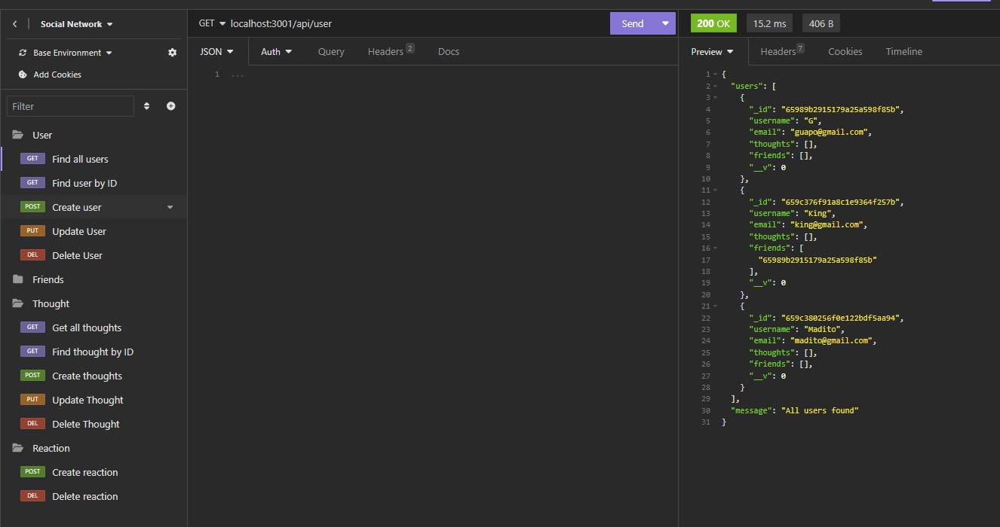

# social-network-api

## Description

Welcome to the social network API repository, a CRUD API used to create users, add friend list, share thoughts and reactions to thoughts. The project was not deployed but please follow the demo link and see the project in action.

Technologies Used include:

- MongoDB
- Mongoose
- Express.js
- Insomnia

Follow link for GitHub repository [Social Network API](https://github.com/brandonlambrecht/social-network)

API routes:

GET

    localhost:3001/api/user
    localhost:3001/api/user/:userID
    localhost:3001/api/thought
    localhost:3001/api/thought/:thoughtID

POST

    localhost:3001/api/thought
    localhost:3001/api/user
    localhost:3001/api/user/:userID/friends/:friendsID
    localhost:3001/api/thought/:thoughtID/reactions

PUT

    localhost:3001/api/user/:userID
    localhost:3001/api/thought/:thoughtID

DELETE

    localhost:3001/api/user/:userID
    localhost:3001/api/user/:userID/friends/:friendsID
    localhost:3001/api/thought/:thoughtID
    localhost:3001/api/thought/:thoughtID/reactions/:reactionsID

## License

None

## Table of Contents

[Installation](#installation)

[Usage](#usage)

[Contribution](#contribution)

[Demo](#demo)

## Installation

To install necessary dependencies, run the following command:

     npm i

## Usage

To use the application type the following into the terminal

    npm run dev

Use an API management platform to test API routes such Insomnia

## Contribution

Open to any suggestions to improve the project. Create an issue with the description contribution and lets work together.

## Demo

Link here for demo (https://drive.google.com/file/d/1bJgeFPFBepiilbFtZkSfs8oA_dB4e-Yz/view) on how to use application.
